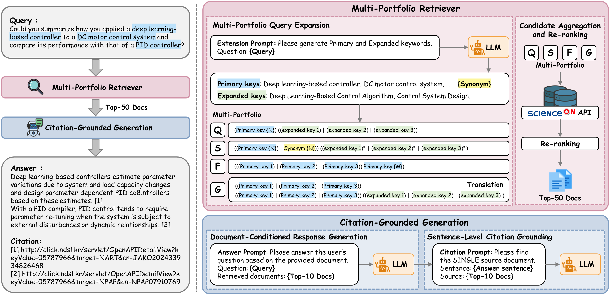

# MPR-CiteG
본 레포지토리는 **SAI Challenge** 참가를 위해 구축한 RAG 기반 파이프라인 코드입니다.  
베이스라인을 확장하여 자체적인 **재순위 전략(Re-ranking)** 및 **문맥 확장(Context Expansion)** 방법을 적용하였으며,  
실행 시 단일 GPU(50GB 이하 VRAM) 환경에서 전체 파이프라인이 동작하도록 최적화하였습니다.

<p align="center">
  
</p>
---

## 📂 프로젝트 구조

```

RAG\_final/
├── main.py                        # 실행 엔트리포인트
├── configs/                       # 설정 파일 및 credential
├── data/
│   └── test.csv                   # 제공된 과학 질문 데이터셋 (50개)
├── outputs/
│   └── final\_submit\_v1.csv        # 최종 제출 결과 (정답 파일)
├── pipelines/                     # 파이프라인 모듈
│   ├── generation.py
│   ├── planners.py
│   ├── retrieval\_pipeline.py
│   ├── scienceon\_api\_example.py
│   └── utils.py
├── environment.yml                # Conda 가상환경 설정 파일 
└── requirements.txt               # 실행 환경 의존성

````

---

## 🚀 실행 방법

### 1. 환경 세팅
```bash
conda env create -f environment.yml
conda activate sai
pip install -r requirements.txt
````

### 2. 실행

```bash
python main.py --device 0
```

* `--device N` : 사용할 GPU index (예: `--device 5`)
* 실행 완료 후 최종 결과는 `outputs/final_submit_v1.csv` 로 저장됩니다.

---

## 📑 출력 파일

* `outputs/final_submit_v1.csv`
  → 50개 과학 질문에 대한 최종 답변 및 참조 결과
  → 이 파일이 제출용 정답 파일입니다.

---

## 🖥️ 실행 환경

* **OS**: Ubuntu 20.04.6 LTS (Focal Fossa)
* **Python**: 3.11
* **CUDA**: 12.2
* **NVIDIA Driver**: 535.104.05
* **GPU**: NVIDIA RTX A6000 (VRAM 49GB) × 1
* **메모리 사용 제한**: 50GB 이하

---

## 📝 추가 사항

* 파이프라인은 제공된 ScienceON API 클라이언트를 기반으로 문헌 검색을 수행합니다.  
* Re-ranking은 `BAAI/bge-reranker-v2-m3` 모델 기반 CrossEncoder를 사용합니다.  
* Answer Generation은 HuggingFace Transformers 기반 LLM을 사용하여 수행합니다.  
  - 기본 모델: `Qwen2.5-14B-Instruct`  
  - 대체 가능 모델: `KISTI-KONI/KONI-Llama3.1-8B-Instruct` (동일 파이프라인에서 실행 가능)

---

## 📧 문의

본 코드는 SAI Challenge 제출을 위해 준비되었으며,
추가 문의사항은 운영팀 지침에 따라 제공 가능합니다.
