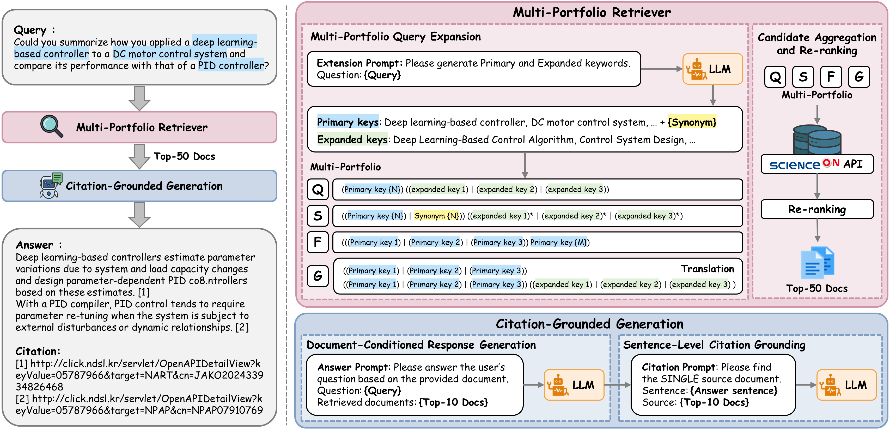

# MPR-CiteG

This repository contains the Retrieval-Augmented Generation (RAG) pipeline developed for participation in the [**SAI Challenge**](https://www.kaggle.com/competitions/sai-challenge/overview).
It introduces a multi-portfolio–based query expansion method combined with a citation-grounded answer generation module.
The entire pipeline is optimized to run on a **single GPU (≤50 GB VRAM)** environment.

<p align="center">
  
</p>

---

## 📂 Project Structure

```
RAG_final/
├── main.py                        # Entry point for execution
├── configs/                       # Configuration files and credentials
├── data/
│   └── test.csv                   # Provided scientific question dataset (50 samples)
├── outputs/
│   └── final_submit_v1.csv        # Final submission results
├── pipelines/                     # Core pipeline modules
│   ├── generation.py
│   ├── planners.py
│   ├── retrieval_pipeline.py
│   ├── scienceon_api_example.py
│   └── utils.py
├── environment.yml                # Conda environment configuration
└── requirements.txt               # Python dependency list
```

---

## 🚀 How to Run

### 1. Environment Setup

```bash
conda env create -f environment.yml
conda activate sai
pip install -r requirements.txt
```

### 2. Execution

```bash
python main.py --device 0
```

* `--device N`: GPU index to use (e.g., `--device 5`)
* After completion, the final output file will be saved as `outputs/final_submit_v1.csv`.

---

## 📑 Output File

* `outputs/final_submit_v1.csv`
  → Contains the final answers and citations for all 50 scientific questions.
  → This file is used as the official submission file.

---

## 🖥️ Execution Environment

* **OS**: Ubuntu 20.04.6 LTS (Focal Fossa)
* **Python**: 3.11
* **CUDA**: 12.2
* **NVIDIA Driver**: 535.104.05
* **GPU**: NVIDIA RTX A6000 (49 GB VRAM) × 1
* **Memory Usage Limit**: ≤ 50 GB

---

## 📝 Additional Notes

* The pipeline retrieves relevant scientific documents via the official **ScienceON API Client**.
* Re-ranking is performed using the **`BAAI/bge-reranker-v2-m3`** CrossEncoder model.
* Answer generation is handled by a Hugging Face Transformers–based LLM.

  * Default model: `Qwen2.5-14B-Instruct`
  * Alternative model: `KISTI-KONI/KONI-Llama3.1-8B-Instruct` (compatible with the same pipeline)

---

## 📧 Contact

This repository was prepared for submission to the **SAI Challenge**.
For further inquiries, please refer to the competition organizers’ official communication channels.
